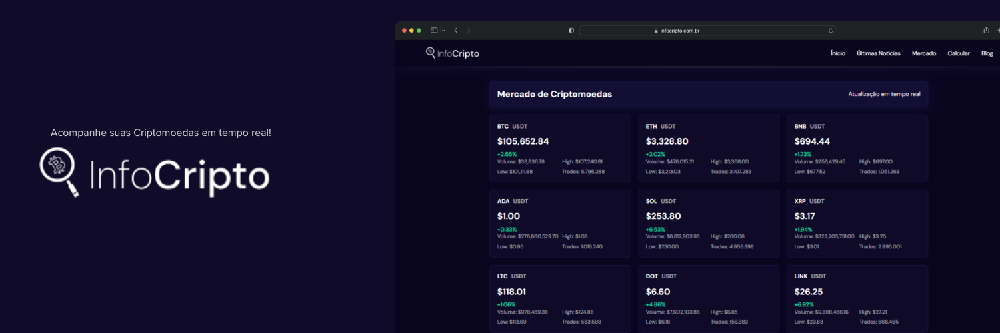
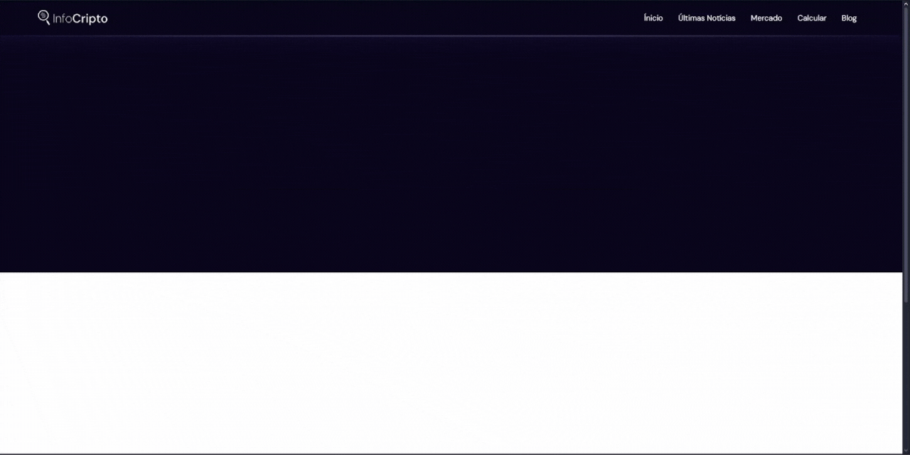
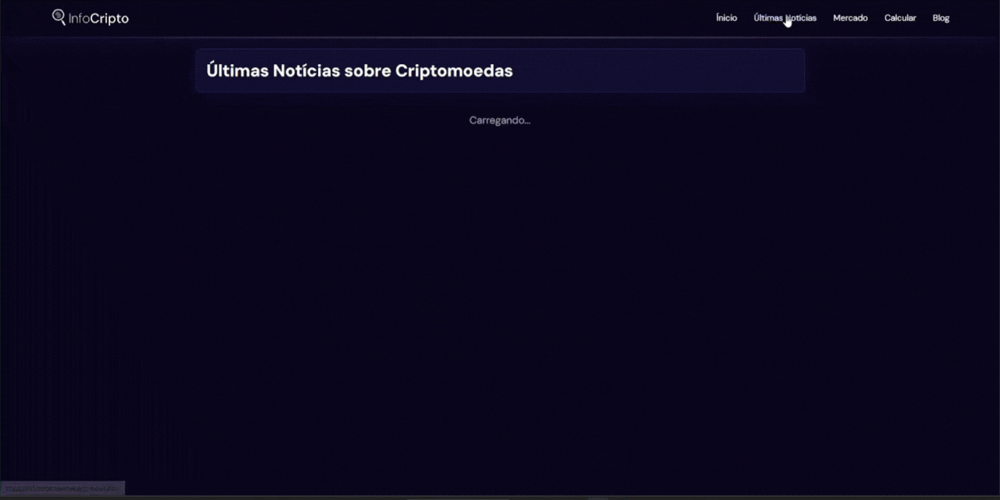
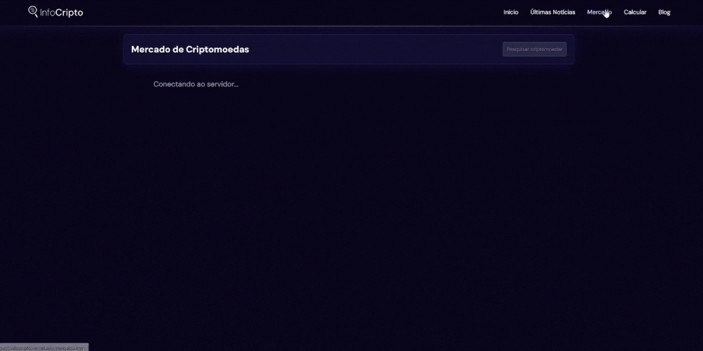
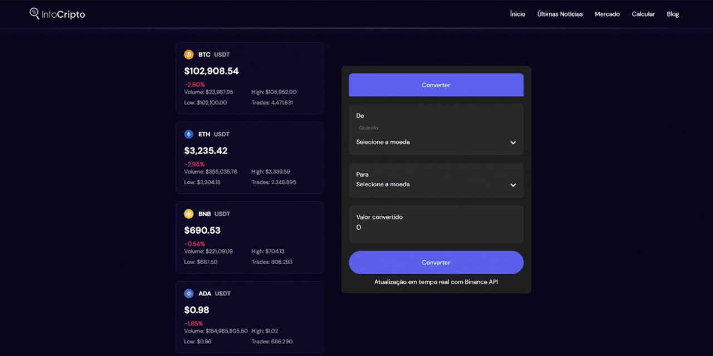
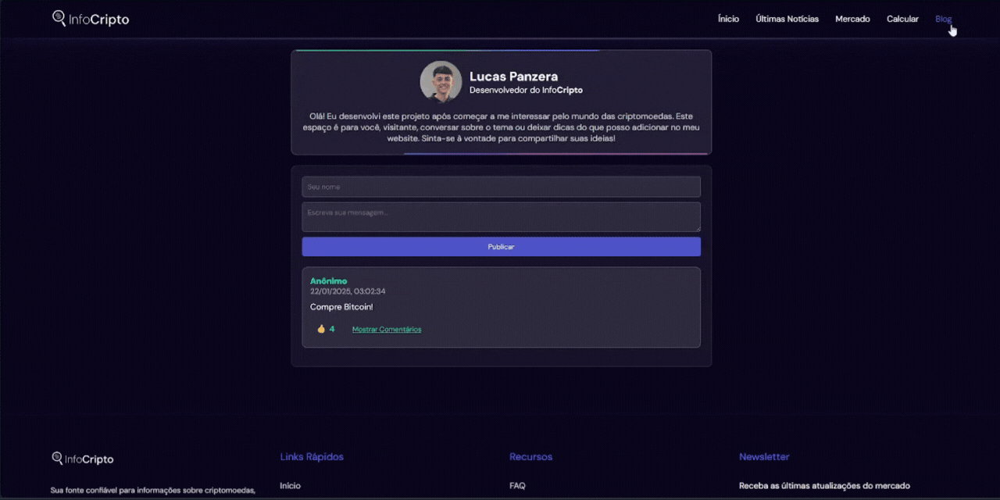

# InfoCripto 🪙
 </br>
Aplicação web que permite ao usuário consultar valores, porcentagens, notícias e falar sobre Criptomoedas.


Projeto desenvolvido com integração da API da <a href="https://api.binance.com/api/v3/ticker/24hr">Binance<a> para informações sobre <b>Criptomoedas</b>, e da <a href="https://cointelegraph.com">Cointelegraph</a> para as notícias.



## Funcionalidades 📱
#### 📰🔍 Vizualização das últimas notícias ligadas a <b>Criptomoedas</b>.


#### 📈⏱️ Mercado de <b>Criptomoedas</b> atualizando em tempo real.
#### 🔬📊 Detalhes sobre a <b>Criptomoedas</b> selecionada. 



#### 💱🔄 Converter valores em <b>Criptomoedas</b>.


#### 💬🌐 Blog interativo.


## Tecnologias Utilizadas 🛠️
<div align="left">
  
  
  
  
</div>

## 🚀 Como Executar o Projeto
```bash
# Acesse
https://infocripto.vercel.app

# Ou

# Clone este repositório
$ git clone https://github.com/lucaspanzera1/InfoCripto.git

# Acesse a pasta do projeto
$ cd InfoCripto

# Abra o arquivo index.html em seu navegador
```
